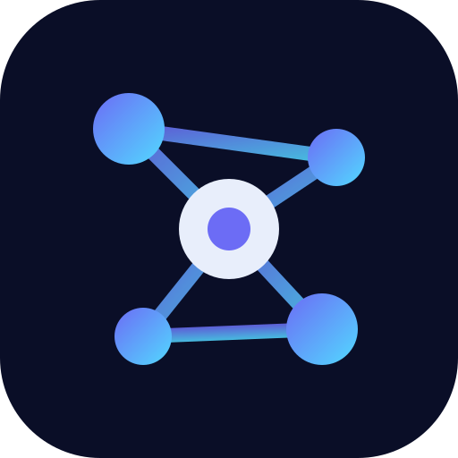

<div align="center">



# Cortex

**The knowledge base your AI can actually read.**

A self-hosted markdown workspace with a 3D knowledge graph, local semantic search,
and a built-in MCP server — so Claude, Cursor or any MCP client can read and write
the notes you already keep, scoped to exactly what you choose to share.

[](LICENSE)
[](https://nextjs.org/)
[](https://sqlite.org/)

</div>

---

## What it is

Cortex stores plain markdown in a single SQLite file and layers three things on top:

- **A graph that understands content.** Beyond the links you write by hand, Cortex
  derives connections from the text itself — embedding similarity and distinctive-term
  co-occurrence — and renders them in a 3D WebGL graph with topic-community colouring.
- **Search by meaning.** Embeddings are computed in-process with `transformers.js`
  (MiniLM). No vector database, no third-party API.
- **An MCP server.** Your agents read and write *as you*, never beyond the spaces your
  account can reach, with per-connection folder restrictions.

There are no plans, seats, quotas or paywalls — it is your server.

## Features

| | |
|---|---|
| **Editor** | Tabs, YAML frontmatter, WikiLinks `[[note]]`, GFM tables, syntax highlighting, Mermaid diagrams, **editable draw.io diagrams**, lazy-loaded embedded images, text-to-speech |
| **Knowledge graph** | 3D force-directed WebGL view, AI-derived edges, topic communities, hover focus, optional webcam hand-tracking navigation |
| **Search** | Local semantic search (embeddings) + SQLite FTS5 full-text |
| **AI assistant** | Chat grounded in your notes using your own API key (BYOK), encrypted at rest with AES-256-GCM |
| **Collaboration** | Organizations by email domain, member roles, per-folder sharing (view/edit), public read-only note links |
| **Import** | Markdown files and folders (structure preserved), Word `.docx`, web pages, PDF (via BYOK) |
| **Agent access** | MCP over OAuth 2.1 + PKCE for web clients, API keys for CLI/editor clients |

## Quick start

```bash
git clone https://github.com/jrcoronel-moon/cortex.git
cd cortex
npm install
cp .env.example .env.local        # set SESSION_SECRET at minimum
npm run dev
```

Open <http://localhost:3000>. Without SMTP configured, the magic-link sign-in URL is
printed to the server log — paste it into your browser to get in.

To make yourself an administrator, set `ADMIN_EMAILS="you@example.com"` in `.env.local`
before first sign-in.

## Configuration

Every variable is documented in [`.env.example`](.env.example). Only `SESSION_SECRET`
is required in production.

| Variable | Purpose |
|---|---|
| `SESSION_SECRET` | Signs session cookies. **Required in production.** |
| `DB_PATH` | SQLite file location (default `./cortex.db`) |
| `ADMIN_EMAILS` | Comma-separated admin accounts |
| `BYOK_ENCRYPTION_KEY` | 32-byte hex key encrypting users' AI provider keys |
| `SMTP_*` | Magic-link delivery; falls back to a test inbox in dev |
| `GOOGLE_CLIENT_ID` / `GOOGLE_CLIENT_SECRET` | Optional Google sign-in |
| `APP_BASE_URL` | Public URL, used for OAuth metadata and invitation links |
| `LITESTREAM_*`, `AWS_*` | Optional continuous SQLite backup to S3 |

## Self-hosting with Docker

```bash
cp .env.example .env              # fill in SESSION_SECRET, SMTP, domain
docker compose up -d --build
```

The stack runs the app, the landing page, Caddy (automatic TLS) and an optional
Litestream sidecar that streams the SQLite database to S3. Edit `Caddyfile` with your
hostnames; drop the `litestream` service if you don't want off-site backups.

Cortex is deliberately small: a Next.js standalone build plus one SQLite file. It runs
comfortably on a 1 GB VPS. **Build the image on your workstation or in CI, not on a
small server** — `next build` needs more memory than the app ever does at runtime.

## Connecting an AI agent

**Claude Code / Cursor / Continue** — create an API key in *Settings → Claude Code*:

```bash
claude mcp add --transport http cortex https://your-host/api/mcp \
  --header "Authorization: Bearer YOUR_KEY"
```

**Claude.ai and other web clients** — copy the connector URL from *Settings → MCP Web*
and paste it into the client. It runs OAuth 2.1 + PKCE with dynamic client registration;
you sign in and approve an explicit consent screen.

Available tools: list spaces, list / search / get / create / update notes. Each
connection can be restricted to specific folders.

Full walkthrough: [`docs/MCP_GUIDE.md`](docs/MCP_GUIDE.md).

## Architecture

```
src/
├── app/              Next.js App Router — pages and API routes
│   ├── api/          REST endpoints (nodes, search, graph, MCP, OAuth, org)
│   ├── admin/        Instance administration
│   ├── org/          Organization management
│   └── settings/     User settings, API keys, MCP connectors
├── components/       Workspace UI (editor, file tree, 3D graph)
└── lib/              Domain logic
    ├── db.ts         SQLite schema, migrations, seed content
    ├── access.ts     Single source of truth for read access
    ├── permissions.ts Write/manage authorization
    ├── embeddings.ts Local embedding generation and semantic search
    ├── mcp.ts        MCP tool implementations
    └── oauth.ts      OAuth 2.1 + PKCE provider
```

**Access control** lives in `lib/access.ts` and `lib/permissions.ts`. Both the UI and the
MCP server resolve permissions through them, so an agent can never reach a note its
user cannot. MCP connections resolve with `adminSeesAll = false`: even an instance
administrator is scoped to their own spaces when acting through an agent.

**Data model** — `nodes` is a self-referencing tree of folders and files (markdown in
`content`); `workspaces`, `organizations` and `folder_shares` define who sees what;
`embeddings` holds one vector per note; FTS5 mirrors note bodies for keyword search.

## Contributing

Issues and pull requests are welcome. Please keep changes focused, run
`npx tsc --noEmit` and `npm run build` before opening a PR, and match the surrounding
code style.

## License

Cortex is free software licensed under the [GNU Affero General Public License v3.0](LICENSE).

In short: you may use, study, modify and redistribute it freely. If you run a modified
version as a network service, you must offer your users the corresponding source code.
